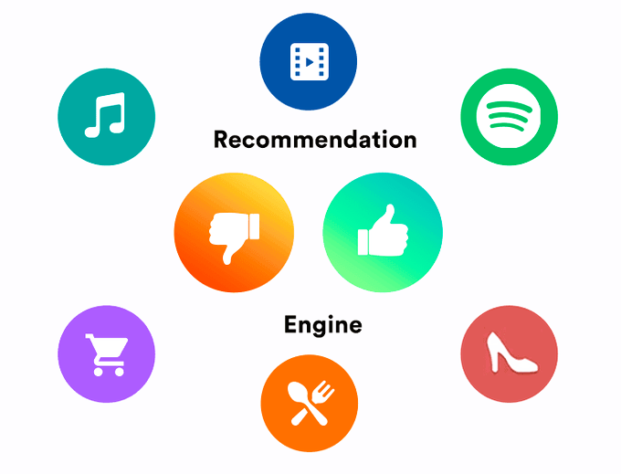
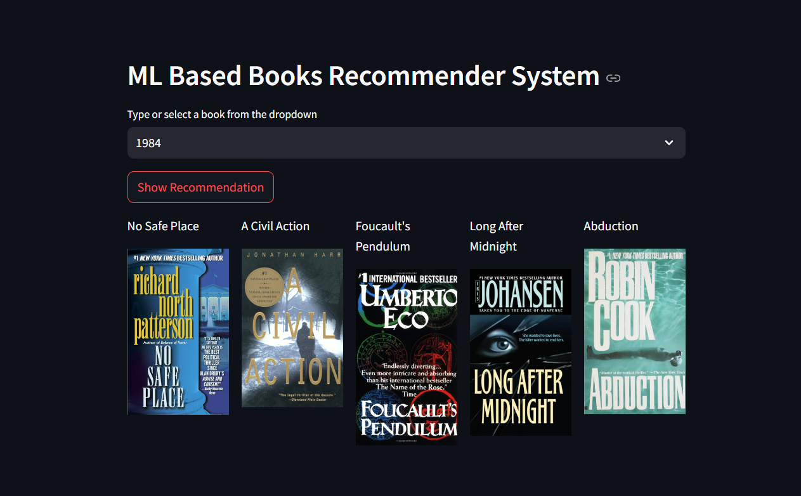
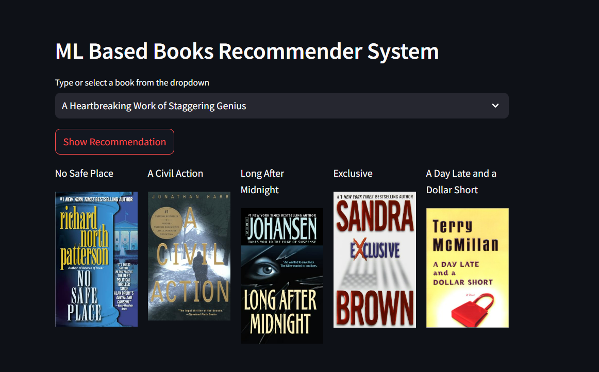
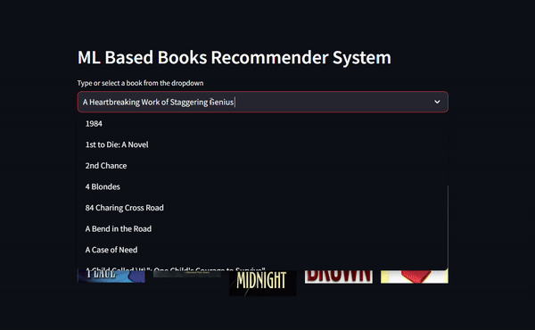

# 📚 ML-Based Book Recommender System | Collaborative Filtering Approach


---



---

## 📝 Introduction
Recommendation systems play a crucial role in helping users make better choices in a busy world. They aim to deliver relevant and personalized content, simplifying decision-making for users by reducing time and effort. Powered by machine learning algorithms, these systems filter through vast amounts of data to present customized suggestions based on user preferences, browsing history, and similar user behaviors.

---

## 📄 Project Overview

> **Interactive Features**: Click the sections below to expand and view details.

<details>
<summary><strong>Types of Recommendation Systems</strong></summary>

### 1. Content-Based Filtering:
- **Description**: Uses content attributes to recommend items similar to those the user has shown interest in.
- **Example Platforms**: Twitter, YouTube
- **Limitation**: Over-specialization can result in repetitive suggestions.

### 2. Collaborative Filtering:
- **Description**: Based on user-item interactions, clustering users with similar preferences.
- **Example**: Book recommendations for users with similar tastes.
- **Limitation**: May overlook new or less popular items.

### 3. Hybrid Filtering:
- **Description**: Combines both content-based and collaborative filtering.
- **Advantages**: Addresses limitations of individual methods, often yielding better recommendations.
</details>

<details>
<summary><strong>Project Goals</strong></summary>

This project builds a collaborative filtering-based book recommender system that leverages user input to provide relevant book suggestions.
</details>

---

## 🖥️ Live Demo




---

## 📊 Dataset

Data used for this project can be found on Kaggle. [Access the Dataset Here](https://www.kaggle.com/ra4u12/bookrecommendation).

---

## ⚙️ Model Development: Nearest Neighbors

The model is built using the Nearest Neighbors algorithm, which follows these steps:
1. Load data
2. Set the `k` value
3. Calculate distances between test and training data (Euclidean Distance)
4. Sort distances and select the top `k` neighbors
5. Predict recommendations

---

## 🛠️ Built With

- [Streamlit](https://streamlit.io/) - Web application framework
- [Scikit-Learn](https://scikit-learn.org/stable/) - Machine learning library

---

## 🏃 Getting Started

To run the project locally, follow these steps:

1. **Clone the Repository:**

    ```bash
    git clone https://github.com/entbappy/ML-Based-Book-Recommender-System.git
    ```

2. **Create a Conda Environment:**

    ```bash
    conda create -n books python=3.7.10 -y
    ```

    ```bash
    conda activate books
    ```

3. **Install Dependencies:**

    ```bash
    pip install -r requirements.txt
    ```

4. **Launch the Application:**

    ```bash
    streamlit run app.py
    ```

    > **Note**: Click on "Train Recommender System" before using the "Show Recommendations" feature to ensure models are generated.

---

## 🎥 Video Walkthrough

> Below is a quick GIF demonstrating the app interface and user flow.



---

## 🧠 How It Works

This system recommends books using collaborative filtering, which identifies user clusters with similar interests. By comparing users’ ratings and interests, the system suggests relevant books based on others with similar tastes.

## 🚀 Future Enhancements

<details>
<summary>Click to View Potential Improvements</summary>

- Integrate a hybrid recommendation model for more accuracy
- Include personalized recommendations based on user demographics
- Add real-time data analysis for recommendations based on trends
</details>

---

## 📄 License

This project is licensed under the MIT License. See the [LICENSE](LICENSE) file for details.

---

For any questions, suggestions, or contributions, feel free to create an issue or pull request. Happy recommending! 📚✨
